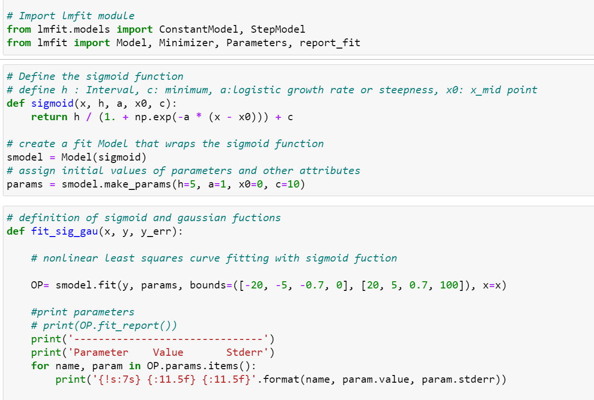
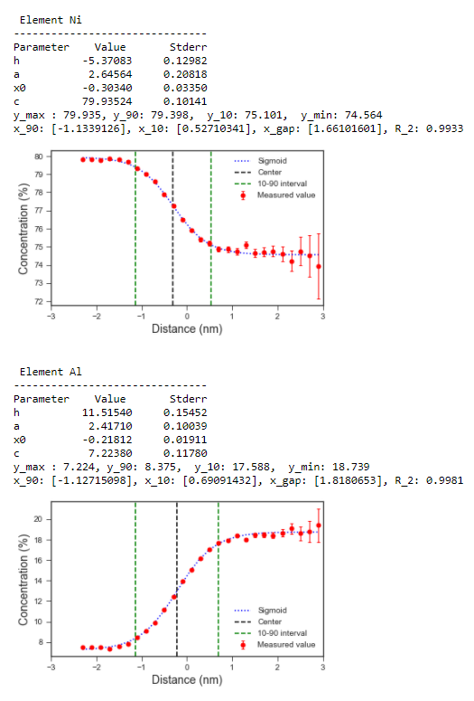
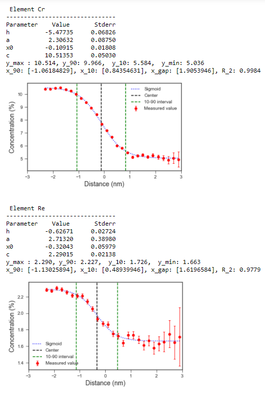
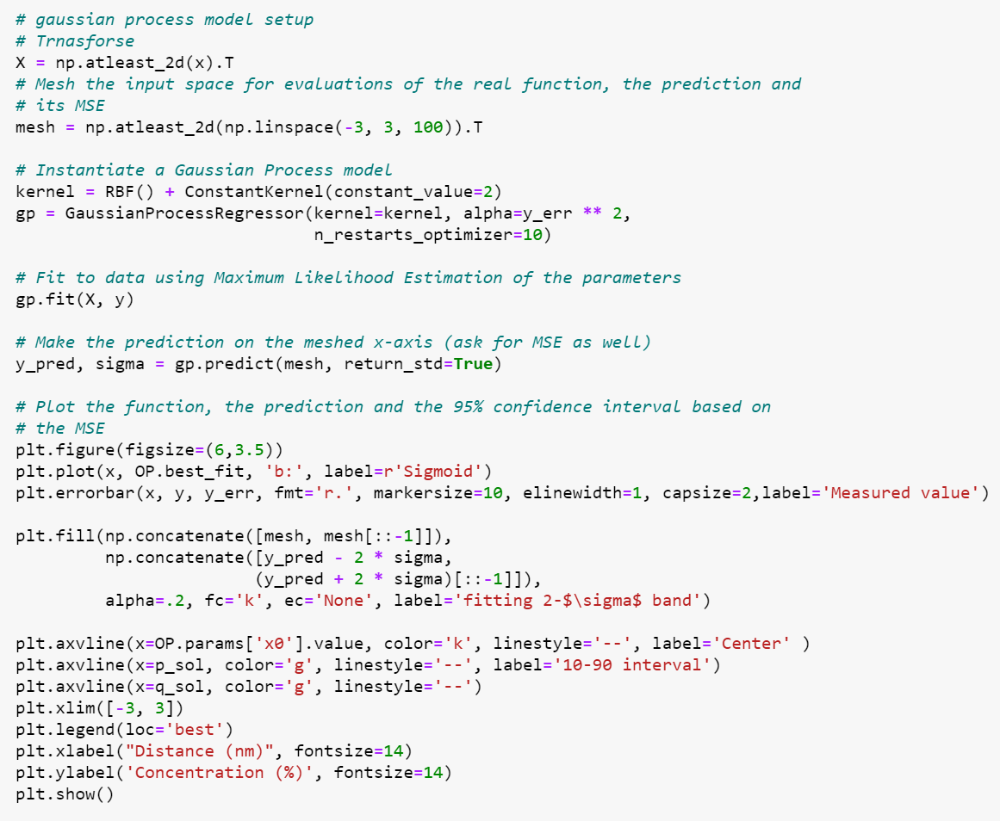
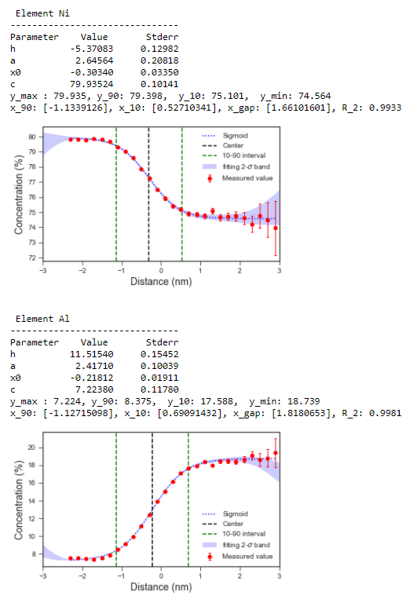
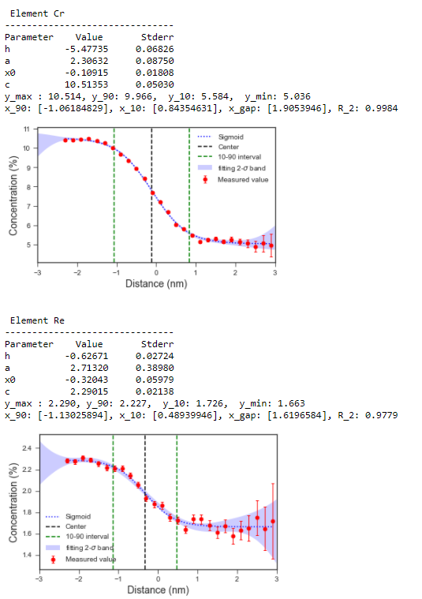

# Interfacial width measurnement
Gamma(f.c.c.)/gamma-prime (L12) precipitate interface measurment

### Example of interfacial width measurements for Nl-Al-Cr-Re alloys

* Coding for sigmoid fuction modeling

* Fitting the model with ATP data

### Fittig with Gaussian error ranges

* Coding of Gaussian fuction for error range

* Fitting the Gaussian model

